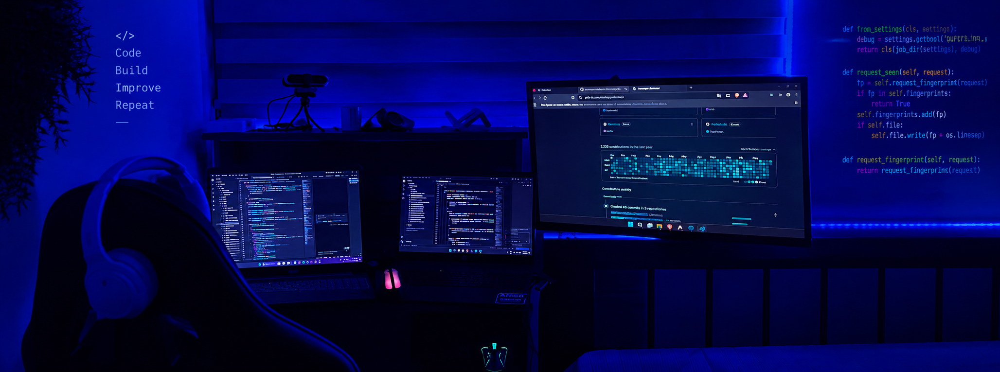

<!-- Top Banner -->

  

---

<!-- Animated Header Wave -->

  

  <!-- Dynamic Typing Hero Subtitle -->
  

  

    <!-- Contact & Social Badges -->
    
    
    
    
    <!-- Profile Views Counter -->
    
  

---

### About Me

Final-year **Systems and Computer Engineering student** at **Universidad del Quindío** and **Software Developer at Sysmicon**.

Specialized in full-stack development with **Spring Boot, Angular, Python, and Node.js**, designing solutions with **Machine Learning & Data Science**, and deploying modern cloud infrastructure with **Docker & AWS**.

---

## Tech Stack

### AI, Machine Learning & Data Science

  

---

### Frontend Development

  

---

### Backend & Databases

  

---

### DevOps & Cloud Infrastructure

  

---

### Tools & Productivity

  

---

### GitHub Streak & Activity

   
  

 

---

<!-- Animated Footer Wave -->

  

